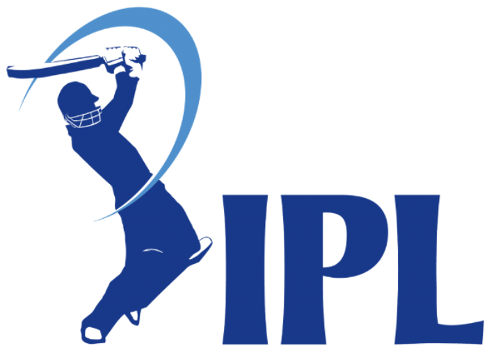

# IPL Infographics: Data Analytics & Data Visualization
[](LICENSE)
[](https://www.python.org/downloads/)
[](#contributors)
## Table of Contents
1. [Introduction](#introduction)
2. [Project Objectives](#project-objectives)
3. [Project Structure](#project-structure)
4. [Use Cases](#use-cases)
5. [Modules Implemented](#modules-implemented)
6. [Data Exploration and Preprocessing](#data-exploration-and-preprocessing)
7. [Modeling](#modeling)
8. [Results](#results)
9. [Visualizations](#visualizations)
10. [How to Use](#how-to-use)
11. [Branches and Contributions](#branches-and-contributions)
12. [Dependencies](#dependencies)
13. [Contributing](#contributing)
14. [Contributors](#contributors)
15. [Acknowledgements](#acknowledgements)
16. [License](#license)
17. [Contact Information](#contact-information)

---
## Introduction
#  IPL Team Points Forecasting🏏
The goal of this module is to forecast the total points of IPL teams based on historical match data, team performance trends, and various influencing factors such as player statistics, match conditions, and opposition strength.

**IPL Infographics: Data Analytics & Data Visualization**
# Project Overview📊
This project aims to analyze IPL data from multiple seasons, build predictive models for runs scored, and deploy the model via a user-friendly interface. It includes detailed data exploration, preprocessing, feature engineering, and advanced modeling.


## Repository Structure📂

The **Indian Premier League (IPL)** is a globally renowned Twenty20 cricket tournament held annually in India. This project involves performing comprehensive data analysis, predictive modeling, and creating insightful visualizations based on IPL data. Our aim is to uncover patterns, trends, and insights that can inform stakeholders and enthusiasts about various aspects of the tournament.
---

## Project Objectives

- **Data Analysis**: Gain insights into player performances, team trends, and venue statistics.
- **Predictive Modeling**: Build models to predict in-game scores, match winners, and forecast player performance.
- **Data Visualization**: Create interactive and informative visualizations to effectively communicate findings.
- **Collaboration**: Leverage the strengths of individual team members through branch-specific contributions.

  
| **File/Folder**                                         | **Description**                                                                |
|---------------------------------------------------------|--------------------------------------------------------------------------------|
| **`EDA_all_season_details.ipynb`**                      | Notebook containing detailed exploratory data analysis across all IPL seasons. |
| **`Final_Notebook_all_season_details(modified).ipynb`** | Streamlined and modified consolidated notebook for a smoother workflow.        |
| **`Final_Notebook_all_season_details.ipynb`**           | Original consolidated notebook containing all analysis steps in one place.     |
| **`IPL_EDA.ipynb`**                                     | Additional exploratory data analysis focusing on IPL-specific details.         |
| **`Initial_Exploration.ipynb`**                         | Notebook documenting the initial data exploration and hypothesis formulation.  |
| **`LICENSE`**                                           | File specifying the project’s terms of use and licensing details.              |
| **`README.md`**                                         | Documentation file providing an overview of the project and usage instructions.|
| **`app.py`**                                            | Flask application script used for deploying the prediction model.              |
| **`base_modeling_all_season_details.ipynb`**            | Notebook for baseline model development and performance evaluation.            |
| **`forecast_runs.ipynb`**                               | Notebook dedicated to forecasting team runs and predicting future outcomes.    |
| **`ipl_documentation.docx`**                            | Comprehensive project documentation in Microsoft Word format.                  |
| **`ipl_pred_model.pkl`**                                | Serialized prediction model saved for deployment purposes.                     |
| **`ipl_pred_model.py`**                                 | Python script for loading and using the serialized prediction model.           |
| **`modeling_all_season_details.ipynb`**                 | Notebook for advanced modeling and hyperparameter tuning tasks.                |
| **`runs_prediction_sample_dataset.ipynb`**              | Notebook with a sample dataset for predicting runs and testing the model.      |


---

## Project Structure
Due to the collaborative nature of this internship project, the repository is organized with multiple branches:
- **Main Branch**: Contains the consolidated project with all functionalities and final deliverables.
- **Intern Branches**: Individual contributions are available in sub-branches named after each intern.
---
## Use Cases
The project addresses three primary use cases:
1. **Predicting In-Game Score**
   - **Approach**: Regression analysis.
   - **Best Models**: Random Forest Regression and XGBoost Regression.
2. **Predicting the Winner**
   - **Approach**: Classification algorithms.
   - **Models Used**: Various machine learning classification models (e.g., Logistic Regression, Decision Trees).
3. **Forecasting Player Performance**
   - **Approach**: Time series forecasting.
   - **Model Used**: ARIMA model (suitable for datasets with fewer data points).
---
# Navigate the Files🚀
1. For detailed EDA: Refer to EDA_all_season_details.ipynb or IPL_EDA.ipynb.

## Modules Implemented
2. For the complete workflow: Open Final_Notebook_all_season_details(modified).ipynb for a streamlined overview.

The project is divided into the following modules:
3. For initial exploration: Start with Initial Exploration.ipynb.

1. **Data Collection (DC)**
2. **Data Exploration and Preprocessing (DEP)**
3. **Model Building (MB)**
4. **Model Evaluation & Presentation (MEP)**
---
## Data Exploration and Preprocessing
### Initial Exploration
- Utilized **Python**, **NumPy**, and **Pandas** for statistical analysis and data manipulation.
- Conducted initial data exploration to understand data distribution and variables.
### Exploratory Data Analysis (EDA)
- Employed **Matplotlib**, **Seaborn**, and **Plotly** for data visualization.
- Created comprehensive visualizations to identify hidden patterns and insights.
#### Sample Visualizations

*Figure 1: Top 10 Scoring Batsmen in the IPL.*

*Figure 2: Top cities most IPL matches played.*
### Data Preprocessing
- **Handling Missing Values**: Applied techniques like mean/median imputation and interpolation.
- **Data Inconsistencies**: Resolved inconsistencies and ensured data quality.
- **Encoding**: Performed nominal and ordinal encoding for categorical variables.
- **Outlier Detection**: Used Z-scores and IQR methods to identify and treat outliers.
- **Trend Analysis**: Analyzed trends, seasonality, and randomness in the data.
---
4. For baseline modeling: Explore base_modeling_all_season details.ipynb.

## Modeling
5. For advanced modeling: Check modeling_all_season_details.ipynb.

### Baseline Models
6. For forecasting runs: Use forecast_runs.ipynb.

- Established baseline models to serve as a benchmark.
### Advanced Models
- **Regression Models**: Random Forest and XGBoost provided superior performance for in-game score prediction.
- **Classification Models**: Implemented various algorithms to predict match winners.
- **Time Series Models**: Used ARIMA for forecasting player performance due to its effectiveness with limited data points.
### Model Optimization
- **Hyperparameter Tuning**: Utilized randomized grid search to optimize model parameters.
- **Cross-Validation**: Applied cross-validation to check for overfitting and ensure model generalizability.
### Inferencing and UI
- Saved encoded and pretrained models.
- Developed inferencing scripts for making predictions on new data.
- Created a user interface for model interaction.
---
## Results
Our advanced modeling approaches significantly outperformed the baseline models:
- **In-Game Score Prediction**: Achieved high accuracy with Random Forest and XGBoost regression models.
- **Winner Prediction**: Successfully predicted match outcomes using classification algorithms.
- **Player Performance Forecasting**: Effectively forecasted performance metrics using the ARIMA model.
---
7. For deployment: Run app.py using the saved model ipl_pred_model.pkl.
## Installation Instructions.💻

## How to Use
1. Clone the repository:
```bash
git clone https://github.com/amalsalilan/IPL_Infographics_Data_Analytics_-_Data_Visualization_Infosys_Internship_Oct2024
```
### Install Dependencies
Ensure you have **Python 3.x** installed. Install required packages:
2. Install required dependencies:
```bash
pip install -r requirements.txt
```
### Running the Models
Navigate to the respective directories for each use case and run the scripts as instructed:
- **In-Game Score Prediction**:
  ```bash
  python models/regression/in_game_score_prediction.py
  ```
- **Winner Prediction**:
  ```bash
  python models/classification/winner_prediction.py
  ```
- **Player Performance Forecasting**:
  ```bash
  python models/forecasting/player_performance_forecasting.py
  ```
### User Interface
To interact with the models via the UI:
1. Navigate to the `ui` directory.
   ```bash
   cd ui
   ```
2. Install UI-specific dependencies:
   ```bash
   pip install -r ui_requirements.txt
   ```
3. Run the UI application:
   ```bash
   python app.py
   ```
4. Open your web browser and go to `http://localhost:5000`.
---
## Branches and Contributions
- **Main Branch**: Contains the final consolidated project.
- **Intern Branches**: Individual contributions can be found in branches named after each intern.
---
## Dependencies

- **Programming Language**: Python 3.x
3. Run the Application Start the Streamlit app:
streamlit run forecasting_app.py

### Key Libraries
open the app in your Browser:

- **Data Manipulation**: NumPy, Pandas
- **Data Visualization**: Matplotlib, Seaborn, Plotly
- **Machine Learning**: Scikit-Learn, XGBoost
- **Time Series Analysis**: Statsmodels (for ARIMA)
- **Web Framework**: Flask (for UI)
- **Others**: See `requirements.txt` for the full list.

---
## Contributing
We welcome contributions from team members:
1. **Fork** the repository.
2. **Create** a feature branch:
   ```bash
   git checkout -b feature/YourFeature
   ```
3. **Commit** your changes:
   ```bash
   git commit -m 'Add a feature'
   ```
4. **Push** to the branch:
   ```bash
   git push origin feature/YourFeature
   ```
5. **Submit** a pull request for review.
---
## Contributors
- **Amal Salilan** - *Project Lead* - GitHub: [amalsalilan](https://github.com/amalsalilan)
- **Nagira R** - *Data Collection and Preprocessing* - GitHub: [Nagira-R](https://github.com/Nagira-R)
- **Pavan Kumar** - *Preprocessing and Modeling, UI Development* - GitHub: [PavanKumar1207](https://github.com/PavanKumar1207)
- **Nomiya Allada** - *Data Analysis* - GitHub: [nomiyaallada](https://github.com/nomiyaallada)
- **Sampath Kumar Illa** - *Data Visualization* - GitHub: [SampathKumarIlla](https://github.com/SampathKumarIlla)
- **Nikita Avhad** - *Model Evaluation* - GitHub: [nikita-avhad](https://github.com/nikita-avhad)
- **D. Aasritha Reddy** - *Data Preprocessing* - GitHub: [Aasritha1105](https://github.com/Aasritha1105)
- **K. Akshya** - *Exploratory Data Analysis* - GitHub: [akshya1205](https://github.com/akshya1205)
- **Bhavithra R S** - *Modeling and Evaluation* - GitHub: [bhavithrars19](https://github.com/bhavithrars19)
- **Reshma Syed Meeran** - *User Interface Development* - GitHub: [Reshmasyedmeeran](https://github.com/Reshmasyedmeeran)
- **Srimannarayana Adapa** - *Data Collection* - GitHub: [SrimannarayanaAdapa](https://github.com/SrimannarayanaAdapa)
- **Govinda Prasad D** - *EDA and Main Project* - GitHub: [PrasadD2003](https://github.com/PrasadD2003)
- **Gopikrishna V** - *Data Analysis* - GitHub: [TianKaiJr](https://github.com/TianKaiJr)
- **Aditya Mehta** - *Modeling* - GitHub: [ADITYAMEHTA2222](https://github.com/ADITYAMEHTA2222)
- **Sai Hitesh** - *Data Preprocessing* - GitHub: [SaiHitesh77](https://github.com/SaiHitesh77)
- **Sagar Thube** - *Data Analysis* - GitHub: [sagarthube130](https://github.com/sagarthube130)
- **Navya Sree Gouru** - *Data Collection* - GitHub: [Navya_Sree_Gouru](https://github.com/Navya_Sree_Gouru)
---
## Acknowledgements
We extend our gratitude to all interns and mentors who contributed to this project, making it a valuable learning experience.
- **Mentors**:
  - **Amal** - Data Science Expert
---
## License
## Workflow Overview⚙️
Key Steps in the Project:

This project is licensed under the [MIT License](LICENSE).
1. Initial Exploration:
Reviewed raw data and formulated hypotheses in Initial Exploration.ipynb.

---
2. EDA:
Conducted comprehensive analysis in EDA_all_season_details.ipynb and IPL_EDA.ipynb.
Key findings include trends in player performance, match outcomes, and seasonal insights.

## Contact Information
3. Preprocessing and Feature Engineering:
Cleaned and transformed the data to ensure compatibility for modeling.

For any queries or suggestions, please reach out to the project maintainers.
4. Modeling:
Baseline models implemented in base_modeling_all_season details.ipynb.
Advanced models tuned in modeling_all_season_details.ipynb.

- **Project Lead**: Amal Salilan
- **Email**: [___________](mailto:amalsalilan@example.com)
5. Forecasting:
Predicted runs for future matches in forecast_runs.ipynb.

---
6. Deployment:
Deployed the final model using Streamlit app:
## Technologies Used:🧑‍💻

## Future Work
Languages and Libraries:
Python, Pandas, NumPy, Matplotlib, Seaborn,plotly, Scikit-learn, streamlit.

- **Expand Dataset**: Incorporate more seasons and detailed player statistics.
- **Advanced Modeling**: Explore deep learning models for prediction tasks.
- **Real-time Data**: Implement real-time data fetching and model updating.
- **Enhanced UI**: Develop a more interactive and user-friendly interface with dashboards.
Tools:
Jupyter Notebook,Word (for documentation).

---
## Acknowledgments:📜

## Notes
Mentor: Special thanks to Amal Salian for guidance and support.

- All visualizations and images are stored in the `images` directory.
- For detailed analysis and reports, refer to the `reports` directory.
- The codebase follows PEP 8 style guidelines for Python code.
Team Members:

---
**Disclaimer**: This project is for educational purposes as part of an internship program. The data and analyses are based on available IPL datasets and are intended to demonstrate data analytics and visualization techniques.
---
Resources: IPL data source and Python community.
